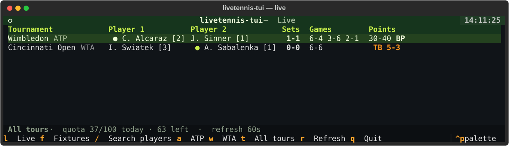
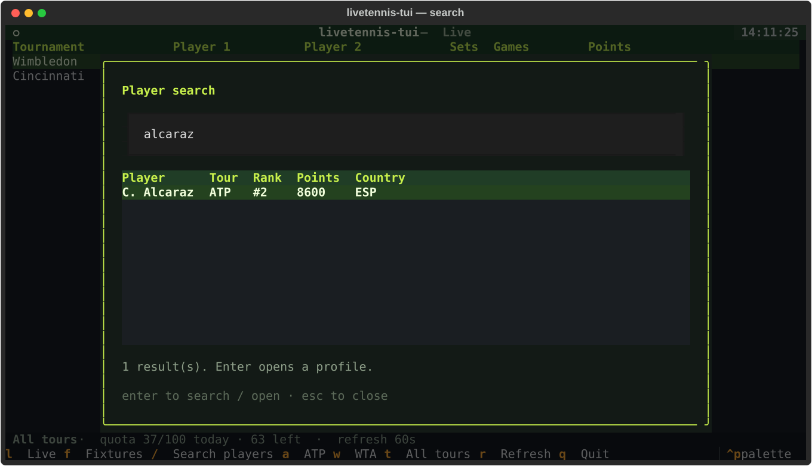

<div align="center">


# livetennis-tui

**Live tennis scores in your terminal** — ATP, WTA, Challenger, ITF and juniors,
on the [Live Tennis API](https://livetennisapi.com). Built with
[Textual](https://textual.textualize.io/) on the official
[`livetennisapi`](https://pypi.org/project/livetennisapi/) Python SDK.

[](https://github.com/livetennisapi/livetennis-tui/actions/workflows/ci.yml)
[](https://github.com/livetennisapi/livetennis-tui)
[](LICENSE)

[**Documentation**](https://docs.livetennisapi.com) · [**Get a free API key**](https://livetennisapi.com/subscribe/free)

</div>

---



## What it does

- **Live view** — every in-play match: tournament, players with world
  rankings, per-set score, current points, a ● serving marker, tiebreaks
  flagged, and a red **BP** badge when the returner holds a break point
  (derived the way the API's own Break-Point Radar derives it: returner at
  AD, or at 40 with the server below 40 — never in a tiebreak).
- **Fixtures view** — upcoming matches, earliest first, with scheduled times
  (a fixture without a time yet shows its day — that's the API being honest,
  not the app being lazy).
- **Player search** — `/` opens a modal search; Enter on a result opens a
  profile card: ranking, points, movement, country, plays, age.
- **Tour filter** — `a` for ATP, `w` for WTA (press again to clear), `t` for
  all tours. The filter is applied server-side, so a filtered refresh costs
  the same one request.

Everything runs on the **FREE tier** — no paid plan needed.



## Install

```bash
pipx install git+https://github.com/livetennisapi/livetennis-tui
```

(or `pip install git+…` into any Python ≥3.10 environment. PyPI pending.)

## Run

```bash
export LIVETENNIS_API_KEY=twjp_…   # a free key takes a minute:
                                   # https://livetennisapi.com/subscribe/free
livetennis-tui
```

The key is looked up in order: `$LIVETENNIS_API_KEY`, then the SDK's own
`$LIVETENNISAPI_KEY`, then `~/.config/livetennis-tui/config` — a plain file
holding either the bare key or:

```ini
api_key = twjp_…
refresh = 60        # optional, seconds; floor 15
```

## Keys

| Key | Action |
|-----|--------|
| `l` | Live view |
| `f` | Fixtures view |
| `/` or `s` | Player search |
| `a` / `w` | Filter ATP / WTA (again to clear) |
| `t` | All tours |
| `r` | Refresh now |
| `q` | Quit |

## Quota honesty

The FREE tier allows **30 requests/minute and 100/day**. This app spends that
budget like so:

- Each auto-refresh is **one** request (the active view only). The default
  cadence is **60 s**, so a continuously open live view spends the 100-call
  day in about 1 h 40 m. Slow it down with `refresh =` in the config
  (the floor is 15 s).
- The quota readout in the status bar comes from the API's `/usage` endpoint,
  which is **quota-exempt** — watching your quota never costs quota.
- When the day's 100 calls are spent, the app **pauses** auto-refresh instead
  of hammering 429s, keeps polling `/usage` (free), and resumes by itself when
  the day rolls over. 401 and 429 render as plain-English messages, not
  tracebacks.

## Development

```bash
git clone https://github.com/livetennisapi/livetennis-tui
cd livetennis-tui
pip install -e ".[dev]"
pytest
```

The test suite runs entirely offline: the SDK's real models are fed canned
payloads, and the app shell is driven with Textual's pilot. The screenshots
above are real SVG captures of the app (Textual's built-in screenshot export)
running against that same mocked data — see `scripts/screenshots.py`.

## Related

- [`livetennisapi`](https://github.com/livetennisapi/livetennisapi-python) — the official Python SDK this app is built on
- [`livetennisapi-mcp`](https://github.com/livetennisapi/livetennisapi-mcp) — the API as an MCP server for LLM agents
- [API documentation](https://docs.livetennisapi.com) — every endpoint, tier and limit

## License

[MIT](LICENSE)
